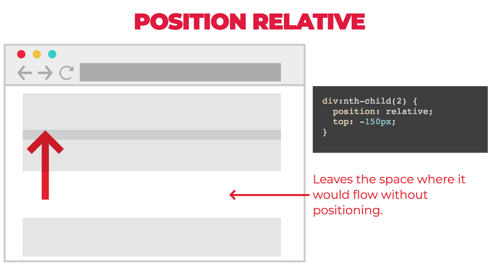

# CSS Position

### [View Codepen Example of Position Relative](https://codepen.io/trevorpreston/pen/MRbdGL)

### [View Codepen Example of Position Absolute](https://codepen.io/trevorpreston/pen/OGbYEz)

### [View Codepen Example of Position Fixed](https://codepen.io/trevorpreston/pen/MRbdBx)

## Additional Resources

- https://cssreference.io/positioning/
- https://internetingishard.com/html-and-css/advanced-positioning/
- http://learnlayout.com/toc.html
- https://medium.freecodecamp.org/css-positioning-explained-by-building-an-ice-cream-sundae-831cb884bfa9
